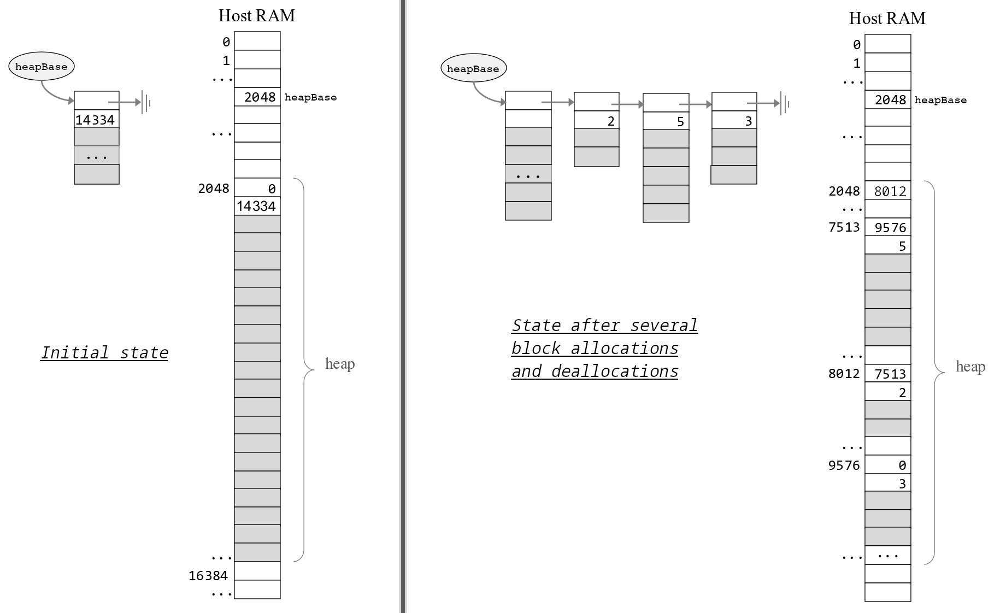

# jack-os

An implementation of the Jack OS standard/runtime library written in Jack, acting as the operating system for the Hack computer and built as part of the [Nand2Tetris](https://www.nand2tetris.org/) course (Project 12).

Provides the runtime services that compiled Jack programs depend on: memory allocation, integer arithmetic, screen and text I/O, keyboard input, string handling, and bootstrapping.


## Usage

Compile the OS together with a `.jack` application in a folder using the [Jack compiler](https://github.com/j0klar/jack-compiler).

```bash
python compiler.py MyApp/    # MyApp/ contains .jack OS files + app files
```


## Modules

**Memory:** `peek`, `poke`, `alloc`, `deAlloc` - heap-based dynamic memory management using a linked free list (heap base 2048, initial free size 14334 words).

**Math:** `multiply`, `divide`, `sqrt`, `min`, `max`, `abs` - O(n) algorithms for multiplication, division, and integer square root.

**Screen:** `clearScreen`, `setColor`, `drawPixel`, `drawLine`, `drawRectangle`, `drawCircle` - direct access to the 512×256 pixels memory-mapped screen starting at address 16384, Bresenham-style line drawing.

**Output:** `moveCursor`, `printChar`, `printString`, `printInt`, `println`, `backSpace` - text output on a 23×64 character grid using an embedded 8×11 pixels font (ASCII 32–126).

**Keyboard:** `keyPressed`, `readChar`, `readLine`, `readInt` - press-and-release monitoring of the memory-mapped keyboard at address 24576.

**String:** `new`, `dispose`, `length`, `charAt`, `setCharAt`, `appendChar`, `eraseLastChar`, `intValue`, `setInt` - character arrays with int-to-string and string-to-int conversion.

**Array:** `new`, `dispose` - array initialization and disposal.

**Sys:** `init`, `halt`, `error`, `wait` - boot sequence, error reporting, and timing.


## Dynamic Memory Management



*Source: Nisan & Schocken, The Elements of Computing Systems, 2nd ed. MIT Press (2021), Slides 60-61 (modified).*


## Project Structure

```
jack-os/
├── Memory.jack
├── Math.jack
├── Screen.jack
├── Output.jack
├── Keyboard.jack
├── String.jack
├── Array.jack
├── Sys.jack
├── memory-alloc.png
```
